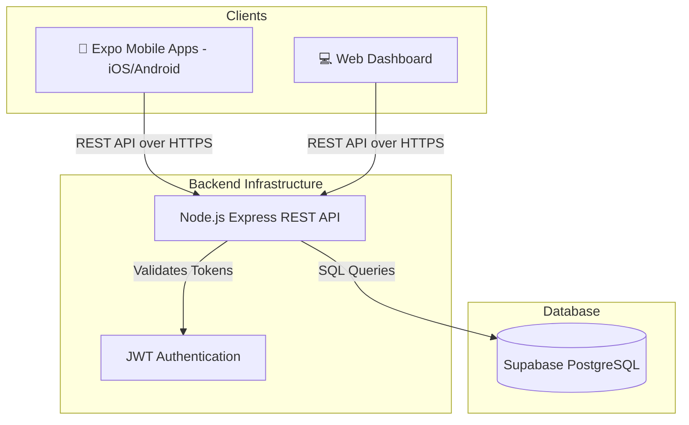

<h1 align="center">
  GomHang Pro 🚀
</h1>

<p align="center">
  <strong>Comprehensive Fullstack Resource Planning & POS for Retail</strong>
</p>

<p align="center">
  <a href="#introduction">Introduction</a> •
  <a href="#key-features">Features</a> •
  <a href="#architecture">Architecture</a> •
  <a href="#installation">Installation</a> •
  <a href="#configuration">Configuration</a> •
  <a href="#folder-structure">Structure</a>
</p>

---

## 📖 Introduction

**GomHang Pro** is an open-source, fullstack POS (Point of Sale) and resource planning application designed specifically for retail. Built with a modern, high-performance tech stack, it provides businesses with robust tools to manage resources, orders, employees, cash shifts, and customer debts simultaneously. 

By combining the agility of a **React Native (Expo)** mobile frontend with a scalable **Node.js (Express)** backend backed by **Supabase PostgreSQL**, GomHang Pro provides a true cross-platform experience (iOS, Android, and Web) from a unified codebase.

---

## ✨ Key Features

- **📱 True Cross-Platform:** Native applications for iOS and Android, plus an administrative Web dashboard, built entirely from one React Native codebase using Expo.
- **🛒 Order & Inventory Management:** Streamline customer checkouts and daily resource allocation.
- **🏢 Cash & Shift Management:** Track employe shifts, opening balances, closing balances, and daily revenues. Automates auto-shift assignments.
- **🤝 Customer Debt & Fee Tracking:** Calculates daily customer fees, tracks debts, and provides simple bookkeeping resolutions.
- **⚡ Real-time Analytics Dashboard:** Live tracking of daily revenue, shipping fees, open shifts, and outstanding payments.
- **📄 Advanced Invoice Exporting:** Generate beautifully formatted image invoices on-the-fly cross platform via HTML5 canvas rendering.
- **🔒 Role-Based Access Control:** Fine-grained permissions with secure authentication (Admin vs. Workers).

---

## 🏗️ Overall Architecture

GomHang Pro's architecture relies on a decoupled, scalable approach. 



The system operates in three main tiers:
1. **Frontend (App/Web):** A single Expo React Native monorepo that outputs native modules to mobile stores or builds as a Web SPA. Uses React Query for powerful state-side caching.
2. **Backend (API):** A stateless Node.js REST API bridging the app to the database, enforcing business logic, computing daily fees, and managing shifts securely.
3. **Database (Supabase):** Fully managed, serverless Postgres database securing sensitive customer and organizational data.

---

## 🚀 Installation

Ensure you have [Node.js](https://nodejs.org/) (v18+) and [Git](https://git-scm.com/) installed on your machine.

### 1. Clone the repository
```bash
git clone https://github.com/tuanasish/gomhangpro.git
cd gomhangpro
```

### 2. Install dependencies for all modules

**For the Backend API:**
```bash
cd backend
npm install
```

**For the Expo Frontend App:**
```bash
cd gomhangpro-app
npm install
```

---

## ⚙️ Env Configuration

Both frontend and backend require environment configurations before running.

### Backend Configuration
Create a `.env` file in the `/backend` directory:
```env
PORT=3000

# Supabase Credentials (from your Supabase Dashboard)
SUPABASE_URL=https://<your-project-id>.supabase.co
SUPABASE_KEY=<your-anon-or-service-role-key>

# JWT Authentication
JWT_SECRET=your_super_secret_jwt_key
```

### Frontend Configuration
Create a `.env` file in the `/gomhangpro-app` directory:
```env
# The URL where your local backend is running
EXPO_PUBLIC_API_URL=http://<your-local-ip-address>:3000/api
```
*(Note: Replace `<your-local-ip-address>` with your actual IPv4 address if you plan to test on a physical mobile device on the same WiFi network).*

---

## 💻 Running the project

Run the services concurrently in separate terminal windows.

**Terminal 1: Start the Backend Server**
```bash
cd backend
npm run dev
```
*(The backend will start at `http://localhost:3000`)*

**Terminal 2: Start the Expo App**
```bash
cd gomhangpro-app
npx expo start -c
```
*(Scan the generated QR code using Expo Go on your phone, or press `w` to open the web version).*

---

## 📂 Folder structure

```text
gomhangpro/
├── backend/                   # Node.js Express API server
│   ├── src/
│   │   ├── controllers/       # Route request handlers
│   │   ├── routes/            # Express route descriptors
│   │   └── index.ts           # Server entry point
│   └── package.json           
│
├── gomhangpro-app/            # Expo React Native App (Mobile & Web)
│   ├── src/
│   │   ├── components/        # Reusable UI components
│   │   ├── context/           # React Context state management
│   │   ├── hooks/             # Custom React Query fetching hooks
│   │   ├── screens/           # Main Views (Separated by Worker/Manager)
│   │   └── navigation/        # React Navigation routers
│   ├── App.js                 # Frontend App Entry point
│   └── package.json
│
├── frontend/                  # Legacy web portal configuration (optional)
├── docs/                      # Technical plans, and specifications
└── README.md
```

---

## 🤝 Contribution Guidelines

We love your input! We want to make contributing to this project as easy and transparent as possible.

1. **Fork the repo** and create your branch from `main`.
2. **Commit your changes**: Provide clear, descriptive commit messages.
3. If you've added code that should be tested, **add tests**.
4. Make sure your code lints. Run prettier and your linters before submitting.
5. Issue a **Pull Request** referencing the issue it resolves.

> **Note:** Please never push `.p8`, `.key`, `.env` tokens, or database URIs to the repo.

---

## 📜 License

This project is licensed under the **MIT License**.  
See the [LICENSE](LICENSE) file for complete details.

---

## 🗺️ Roadmap

- [x] Initial Fullstack Architecture & Monorepo Setup
- [x] Auth, Shifts, and Mobile Order Creation APIs
- [x] Real-time Dashboard Analytics
- [x] Cross-platform Web Image Generation for Receipts
- [ ] Automated Printer Spooling over ESC/POS network
- [ ] Push Notifications for Shift Warnings via Expo APNs
- [ ] Offline-first Mode (AsyncStorage sync layer)
- [ ] Supplier & Supply Chain Tracking Plugins

---
<p align="center">
  <i>Built with ❤️ by tuanasish for GomHang.</i>
</p>
